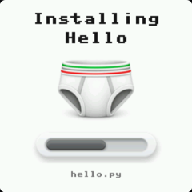
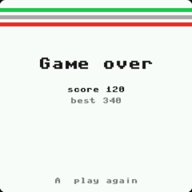
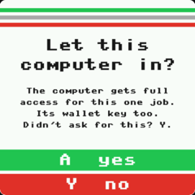

# Style guide: one look on every wedgie

Every screen a wedgie shows looks like it came from the same place. This covers firmware, every app
in `firmware/`, and the hosts that drive a wedgie (the site, `wedgie.py`). Apps people write get the
same rules in `public/code.md` ("Look and feel").

**Enforced:** `python3 tools/test_style.py` (static) and `node tools/busyprobe.mjs` (the site, with
fake wedgies). Anything not on the guide yet is listed in `KNOWN` in test_style.py, and that list may
only shrink. A new screen that breaks a rule fails the build.

## 1. Busy = the boot loader

When a wedgie is doing something that takes time, it shows the boot screen: the logo, a title saying
what it's doing, the boot bar, and a line under the bar saying the current step. That covers installs,
updates, a computer copying files, signing, making a key, loading a level, anything.

- **Title = what it's doing**, as a doing word: "Updating firmware", "Installing Buttons", "Signing",
  "Putting saves back". Not "Please wait".
- **The line under the bar = the step**: "slot.py", "on the ATECC608", "tiles".
- **The bar fills as it goes.** With no way to measure, it sits empty and fills at the end.
- **Never** "working...", "loading...", "please wait", a trailing "...", a spinner, or a bar of your own.

| Where | Use |
|---|---|
| Firmware, apps | `bar = ui.progress(title, step)`, then `bar.to(0..1)`, `loader.what(step)` |
| The site (raw REPL) | `files.ts`: `busy(r, title)` puts it up (`takeOver` does it for every job), `progress(r, p, step)`, and `writeFile` moves it |
| `wedgie.py` | `Wedgie.busy(title)` (`take_over` does it), `progress`, and `put` moves it |

`files.ts writeFile` and `wedgie.py put` are the only ways a host writes a file, and they refuse to
write unless the busy screen is up. A host can't copy files under a blank or stale screen.

## 2. Colors

System screens and every app's own UI (text, hints, yes/no, errors) use the palette in
`firmware/ui.py`. The site's drawings of wedgie screens use the same values (`src/ui/palette.ts`).

| Name | Hex | For |
|---|---|---|
| `ui.WHITE` | `#fefefe` | the screen |
| `ui.INK` | `#1a1b1a` | text |
| `ui.MUTED` | `#787b78` | second lines, hints, the step under the bar |
| `ui.GREEN` | `#22c452` | yes, go, the A button, the waistband's top stripe |
| `ui.GREEN_D` | `#168c34` | green text on white |
| `ui.GREY` | `#a9aaab` | the waistband's middle stripe |
| `ui.RED` | `#e3312c` | no, errors, the Y button, the waistband's bottom stripe |

- Never re-type a palette color (`color(34, 196, 82)`): use `ui.GREEN`.
- Never use lcd's raw colors (`L.WHITE`, `L.RED`, `L.BLUE`...) for anything a person reads. They
  aren't the palette.
- Game art (sprites, levels, backgrounds) may use any colors of its own.

## 3. Three screens

| `ui.page` | `ui.ask` | `ui.progress` |
|---|---|---|
|  |  |  |
| a message: white, the waistband, a big title, lines, a hint at the bottom | a yes/no question: A yes, Y no, only real presses count | busy (section 1) |

Every system screen is one of these. An app's own UI (its menus, its game over, its errors) uses
them too. An app that draws text without `import ui` fails the test.

## 4. Buttons and words

- **A (green)** is yes, go, again. **Y (red)** is no, back. The same on every screen.
- The hint sits at the bottom in `ui.MUTED`: "A  play again".
- Text: 8 px font. Scale 1 fits 28 characters across, scale 2 fits 15 (`ui.COLS_SMALL`, `ui.COLS_BIG`).
  `ui.wrap` breaks lines, `ui.title` draws a big one.
- Words: plain and short. Say what is happening or what to do. No "..." on a screen.

## 5. Adding something new

- A new slow thing: `ui.progress` (firmware) or `busy` + `writeFile` (site), titled with what it does.
- A new host path that writes files: through `writeFile` / `put`. test_style.py fails on any other writer.
- A new system screen: `ui.page` / `ui.ask` / `ui.progress`, never a new layout.
- A new color for UI: add it to `ui.py` and `palette.ts`, with what it's for, here.
- A new rule: add it here and a check for it in test_style.py, in the same commit.
